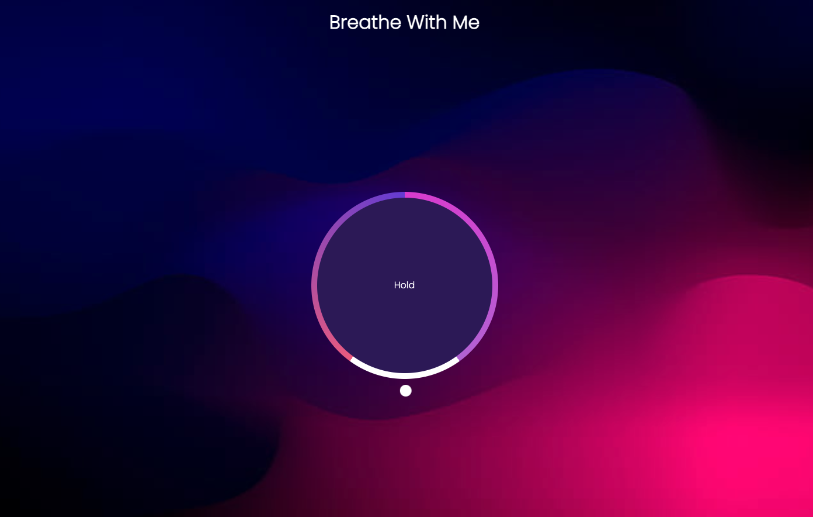

<h1 align="center">Breathe With Me Application</h1>

<i>A simple application made as a challenge to review CSS animations with JavaScript</i>

## Website

## Specifications

- [ ] [Link to application](https://breathewithme.netlify.app/)
- [ ] Creation of circles using gradient with custom CSS
- [ ] Implemented JavaScript animations
